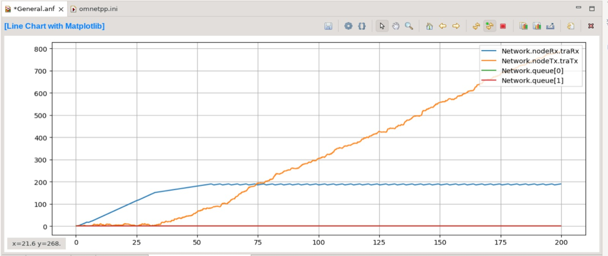

# Laboratorio 4 - Capa de transporte

**Integrantes:**

* **Agustín Farace**: [agustin.farace@mi.unc.edu.ar](https://mail.google.com/mail/u/0/#inbox?compose=CllgCHrhTrtBKzRszJGPkrvGxlpHQDMRClRwNPhXbHrnQtXbLGgqrhTlGFCCVBZxLmckBTZTqsq)

* **Ramiro Cuellar**: [ramiro.cuellar@mi.umc.edu.ar](https://mail.google.com/mail/u/0/#inbox?compose=CllgCHrhTrtBKzRszJGPkrvGxlpHQDMRClRwNPhXbHrnQtXbLGgqrhTlGFCCVBZxLmckBTZTqsq)

Análisis de flujo y congestión de redes utilizando simulación discreta
-
Este trabajo se centró en simular el comportamiento del productor-consumidor en una red con un nodo generador(generator), un nodo resumidero (sink) y un buffer intermedio. Las mediciones que se realizaron indicaron que se perdían paquetes debido a problemas de flujo y congestión. Finalmente se implementó un algoritmo para solucionar el problema de control de flujo y mejorar el rendimiento de la red.

## Introdcción

En el ámbito de las redes de computadoras, la eficiencia en la transmisión de datos es crucial para el rendimiento general del sistema. Dos problemas comunes que pueden afectar esta eficiencia son el control de flujo y la congestión. El control de flujo se refiere a la gestión de la tasa de transmisión de datos entre un emisor y un receptor para evitar que el receptor se vea abrumado por un exceso de datos. Por otro lado, la congestión ocurre cuando los recursos de la red, como el ancho de banda o los buffers, se saturan debido a una alta demanda de tráfico, lo que resulta en la pérdida de paquetes y un rendimiento degradado.

Para abordar estos problemas, se emplean diversas metodologías y técnicas. En este estudio, se ha utilizado la simulación discreta mediante la plataforma OMNeT++, un entorno de simulación extensible y modular, ampliamente utilizado para la modelación y simulación de redes de comunicación. La simulación discreta permite modelar el comportamiento de un sistema a través de eventos discretos en el tiempo, proporcionando una herramienta poderosa para analizar y predecir el comportamiento de sistemas complejos bajo diversas condiciones.

El presente trabajo se centra en el análisis de la capa de transporte de una red, utilizando una configuración simplificada de dos nodos: un productor y un consumidor, conectados a través de un buffer intermedio. Durante las simulaciones iniciales, se observaron pérdidas de paquetes significativas debido a problemas de flujo y congestión. Para mitigar estos problemas, se implementó un algoritmo específico diseñado para mejorar el control de flujo y manejar de manera eficiente la congestión en la red.

## Tarea análisis

Para esta tarea, el experimento que se realizará consiste en una simulación de 200 segundos donde el nodo generador (node Tx) genera y transmite paquetes en intervalos dados por una distribución exponencial centrada en un valor configurable hacia el nodo receptor (node Rx). El buffer de la red y del nodo Rx tienen una capacidad máxima de 200 paquetes mientras que la capacidad del buffer del nodo Tx se fijó en un valor alto (2000000) y el tiempo que tienen para atender un paquete es de 1ms.

Se realizarán simulaciones para dos casos de estudio que comprenderan las configuraciones de las conexiones.

- **Caso de estudio 1**
  * NodeTx a Queue: datarate = 1 Mbps y delay = 100 us
  * Queue a NodeRx: datarate = 1 Mbps y delay = 100 us
  * Queue a Sink: datarate = 0.5 Mbps

- **Caso de estudio 2**
   * NodeTx a Queue: datarate = 1 Mbps y delay = 100 us
   * Queue a NodeRx: datarate = 0.5 Mbps y delay = 100 us
   * Queue a Sink: datarate = 1 Mbps

### Caso 1

| generationInterval | Carga ofrecida (paquetes/segundo) | Carga útil (paquetes/segundo) | Paquetes perdidos |
|:------------------:|:---------------------------------:|:-----------------------------:|:-----------------:|
| exponential(0.1)   | 1979 (9.90)                       | 998 (5)                       | 770               |
| exponential(0.15) | 1307 (6.54)                       | 998 (5)                       | 108               |
| exponential(0.16) | 1238 (6.19)                       | 997 (4.99)                       | 40               |
| exponential(0.17) | 1162 (5.81)                       | 997 (4.99)                       | 0               |
| exponential(0.2) | 989 (4.95)                       | 976 (4.88)                       | 0               |
| exponential(0.3) | 659 (3.30)                       | 655 (3.28)                       | 0               |
| exponential(0.5) | 390 (1.95)                       | 389 (1.95)                       | 0               |
| exponential(1) | 200 (1)                       | 200 (1)                       | 0               |

### Caso 2

| generationInterval | Carga ofrecida (paquetes/segundo) | Carga útil (paquetes/segundo) | Paquetes perdidos |
|:------------------:|:---------------------------------:|:-----------------------------:|:-----------------:|
| exponential(0.1)   | 1979 (9.90)                       | 998 (5)                       | 770               |
| exponential(0.15) | 1307 (6.54)                       | 998 (5)                       | 108               |
| exponential(0.16) | 1238 (6.19)                       | 997 (4.99)                       | 40               |
| exponential(0.17) | 1162 (5.81)                       | 997 (4.99)                       | 0               |
| exponential(0.2) | 989 (4.95)                       | 976 (4.88)                       | 0               |
| exponential(0.3) | 659 (3.30)                       | 655 (3.28)                       | 0               |
| exponential(0.5) | 390 (1.95)                       | 389 (1.95)                       | 0               |
| exponential(1) | 200 (1)                       | 200 (1)                       | 0               |

Notar que en ambos casos obtenemos los mismos resultados. La diferencia radica en lo que sucede en los buffers de cada nodo y del network. En el caso 1 el nodo receptor se satura, mientras que en el caso 2, el buffer intermedio se satura.

Veamos que sucede en los buffers, comenzando por el caso 1.

- **exponential(0.1)**

Aqui vemos cómo la congestión se produce en el nodo receptor, donde a partir del segundo 40 aproximadamente comienza a perder paquetes. El problema de cuando un emisor rápido satura a un receptor lento se conoce como **control de flujo**.

- **exponential(0.2)**

Si duplicamos el intervalo de generación, ya no se perderan paquetes.

- **exponential(0.17)**

Para esta simulación de 200 segundos un intervalo de generación con distribución exponencial centrado en 0.17 resulta el mejor escenario posible, pues llegan una mayor cantidad de paquetes y no se pierden ninguno (notar que si el tiempo de la simulacion fuera mayor podrían perderse paquetes). En cambio, con un intervalo centrado en 0.16 se pierden paquetes.

Para ver las gráficas otros intervalos de generación, consultar la carpeta *graficos*.

Analicemos el caso 2.

- **exponential(0.1)**

- **exponential(0.2)**

- **exponential(0.17)**

Aqui vemos que el problema se presenta en el buffer **intermedio** de la red, lo que quiere decir que es un problema de **control de congestión**. Podemos ver esta situación reflejada en el gráfico de Carga ofrecida vs. Carga útil; La función se "allana" debido a la pérdida de paquetes. De este gráfico podemos ver que el mejor intervalo que garantiza la mayor entrega de paquetes y que no se pierda ninguno es el 0.17, al igual que en el caso 1.

## Preguntas
1. **¿Qué diferencia observa entre el caso de estudio 1 y 2?** Que en el caso 1 el cuello de botella es en el nodo receptor, lo que indica un problema de control de flujo, y en el caso 2 el cuello de botella es en un nodo intermedio entre el emisor y el receptor, lo que indica un problema de controlde congestión.
2. **¿Cuál es la fuente limitante en cada uno?** En el caso 1 es el nodo Rx y en el caso 2 es el buffer intermedio.
3. **Investigue sobre la diferencia entre control de flujo y control de congestión**. El control de flujo es un mecanismo que regula la cantidad de datos que el emisor puede enviar antes de recibir una confirmación del receptor. Su principal objetivo es evitar que el receptor se vea abrumado por más datos de los que puede procesar o almacenar. Por ejemplo, si un dispositivo A está enviando datos a un dispositivo B que tiene una capacidad de procesamiento limitada, el control de flujo asegura que A no envíe más datos de los que B puede manejar a la vez, evitando así pérdidas de datos y la necesidad de retransmisiones. El control de congestión es un conjunto de mecanismos y técnicas diseñadas para prevenir y aliviar la congestión en la red. La congestión ocurre cuando demasiados datos se intentan enviar a través de la red simultáneamente, superando la capacidad de los recursos de la red y provocando la pérdida de paquetes y altos retrasos. Por ejemplo, en una red corporativa con múltiples usuarios accediendo a recursos simultáneamente, el control de congestión ayuda a distribuir el ancho de banda de manera eficiente, reduciendo el riesgo de que la red se sature y asegurando que todos los usuarios tengan un rendimiento aceptable. En conclusión, tanto el control de flujo como el control de congestión son esenciales para el funcionamiento eficiente de las redes de comunicación. Mientras que el control de flujo se centra en la interacción entre el emisor y el receptor, el control de congestión aborda los problemas a nivel de la red completa, asegurando una transmisión de datos eficiente y minimizando la pérdida de paquetes y los retrasos.

## Tarea diseño

- **exponential(0.1)**

Notar como la curva del nodo traRx se aplana antes de llegar a 200 debido a que el algoritmo ralentiza el envío de paquetes desde el módulo traTx hacia fuera de nodeTx cuando el remanente del buffer de traRx sobrepasa cierto umbral (tamaño del buffer - 50 y tamaño del buffer - 10). Esto explica por qué nuestro algoritmo no funciona para el caso 2, pues los paquetes se congestionan en el nodo queue[0]. Por ello, una mejora en nuestro algoritmo seria también considerar el tamaño de los buffer y mandar esa información en los paquetes feedback. 

En este gráfico también podemos observar el tamaño del buffer de traTx el cual va en aumento a medida que se disminuye el intervalo de generación de paquetes.

## Conclusión

Pudimos comprender cómo es el funcionamiento de la capa de transporte de una red de comunicación, pero más que nada, aprendimos como abordar los problemas que esta capa se encarga de resolver

## Anexo

La única herramienta de inteligencia artificial que se usó fue chatGPT solo para cuestiones del informe.