# Laboratorio 4 - Capa de red

**Integrantes:**

* **Agustín Farace**: [agustin.farace@mi.unc.edu.ar](https://mail.google.com/mail/u/0/#inbox?compose=CllgCHrhTrtBKzRszJGPkrvGxlpHQDMRClRwNPhXbHrnQtXbLGgqrhTlGFCCVBZxLmckBTZTqsq)

* **Ramiro Cuellar**: [ramiro.cuellar@mi.umc.edu.ar](https://mail.google.com/mail/u/0/#inbox?compose=CllgCHrhTrtBKzRszJGPkrvGxlpHQDMRClRwNPhXbHrnQtXbLGgqrhTlGFCCVBZxLmckBTZTqsq)

Análisis de tráfico de red bajo distintas estrategias de enrutamiento
- 
Este trabajo se centró en simular el tráfico de una red de topología [aniillo](https://es.wikipedia.org/wiki/Red_en_anillo) y analizarlo en base a estadisticas definidas. 

## Introducción

En el vasto panorama de las redes de comunicación, la eficiencia del enrutamiento de datos juega un papel fundamental en la garantía de la transmisión fluida y confiable de información.

El presente informe aborda el análisis detallado del tráfico en una red de topología anillo, donde los paquetes de datos son encaminados en sentido horario a través de los nodos hasta alcanzar su destino. 

El objetivo principal de este trabajo es explorar y evaluar un algoritmo de enrutamiento diseñado específicamente para mitigar los problemas de congestión que pueden surgir en redes. Para lograr este propósito, se implementó y comparó el desempeño de dicho algoritmo con respecto a un enfoque convencional de enrutamiento.

Para analizar el comportamiento de la red se realizarán experimentos basados en simulación y se usarán las siguientes métricas:

- **hopCount**: Mide los saltos hechos por los paquetes cuando llegan a destino. Los registra a medida que se van recibiendo.
- **bufferSize**: Métrica dada por la cátedra. Indica la cantidad de paquetes en el enlace de un nodo esperando ser procesados.
- **totalDelay**: Métrica dada por la cátedra. Indica el tiempo que pasó desde que un paquete se crea hasta que llega a su destino.

Tarea Análisis
-
Esta tarea se basa en analizar dos casos de estudios: En el primero, el nodo 0 y 2 transmiten hacia el nodo 5. En el segundo, todos los nodos de la red transmiten hacia el nodo 5.

El algoritmo de enrutamiento que se usa para esta tarea, decide enviar los paquetes en sentido horario.

### Análisis de los experimentos

**Caso 1:**

Configuración:
- Network.node[0].app.interArrivalTime = exponential(1)
- Network.node[0].app.packetByteSize = 125000
- Network.node[0].app.destination = 5
- Network.node[2].app.interArrivalTime = exponential(1)
- Network.node[2].app.packetByteSize = 125000
- Network.node[2].app.destination = 5

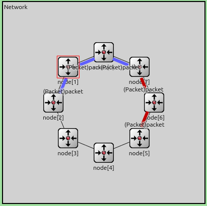

Aqui se ve el funcionamiento del algoritmo de enrutamiento. Los nodos 0 y 2 transmiten paquetes hacia el nodo 5 en sentido horario. Podemos notar que no ningún paquete pasa por los nodos 3 y 4, lo que nos da un indicio de que habrá una sobrecarga en la red

Respecto a los saltos, si vemos el siguiente gráfico:

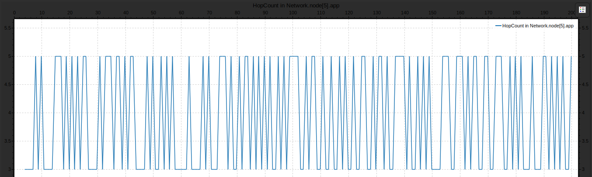

vemos que los paquetes que llegan a destino tienen una cantidad de saltos que alterna entre 3 y 5. Es fácil ver, por la imagen anterior, que los paquetes que genera el nodo 0 hacen 3 saltos y los que genera el nodo 2 hacen 5 saltos. Notar que si el enrutamiento fuese óptimo deberían llegar paquetes del nodo 2 más seguido ya que hay un camino más corto entre entre este y el nodo 5, sin embargo el gráfico nos muestra que llegan paquetes alternadamente.

Veamos que sucede con los buffers.

**Buffer nodo 0**:

![TA_buffer[0]_caso1](graficos/caso1/TA_buffer[0]_caso1.png)

**Buffer nodo 2**:

![TA_buffer[2]_caso1](graficos/caso1/TA_buffer[2]_caso1.png)

En el nodo 0 se puede observar un aumento lineal de la cantidad de paquetes encolados. Esto se debe a que no solo genera paquetes, si no que también recibe los paquetes generados por el nodo 2.

Vemos que en el nodo 2 la situación es diferente puesto que solo genera paquetes.

Finalmente, analicemos la demora total de los paquetes al llegar al nodo 5.

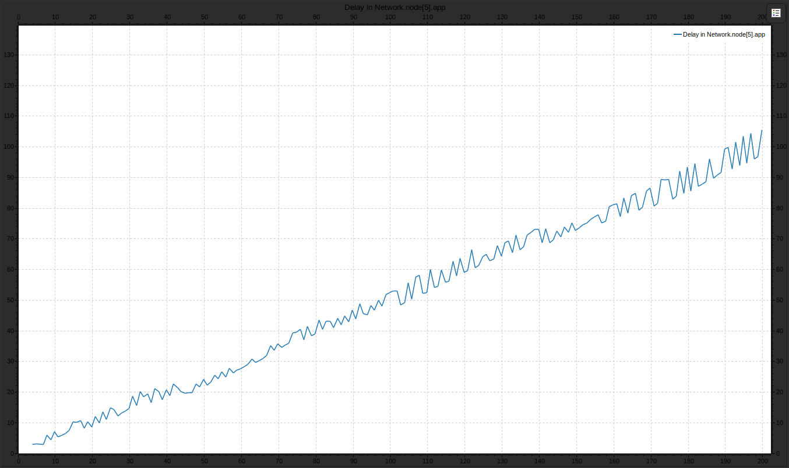

Como vimos antes, la cantidad de paquetes encolados en el nodo 0 crecía linealmente, esto sumado a la demora de atravesar los otros nodos hace que la demora sea cada vez mayor. Esta demora es causada por el algoritmo de enrutamiento, que provoca una sobrecarga en la red. La denora promedio de un paquete es de 51.15s

Se pierden muchos paquetes (llegan 196 paquetes, lo cual es mucho menor a la cantidad generada por los nodos). Si bien los paquetes generados por el nodo 0 toman la ruta más corta, provocan una sobrecarga en la red, lo que termina provocando el problema anterior. Este caso puede mejorarse si los paquetes del nodo 2 recorrieran el network en sentido antihorario.

**Caso 2:**

Configuración:
- Network.node[{0,1,2,3,4,6,7,8}].app.interArrivalTime = exponential(1)
- Network.node[{0,1,2,3,4,6,7,8}].app.packetByteSize = 125000
- Network.node[{0,1,2,3,4,6,7,8}].app.destination = 5

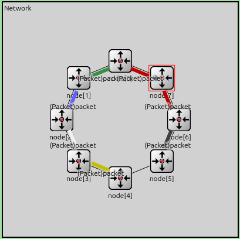

Se puede ver que el problema de sobrecarga de la red es mayor, pues todos los nodos (excepto el 5), generan paquetes. También se puede ver que el enrutamiento no es óptimo ya que los paquetes que crea el nodo 4 hacen un recorrido muy largo cuando debería ser mínimo.

Veamos cuantos saltos hacen los paquetes.

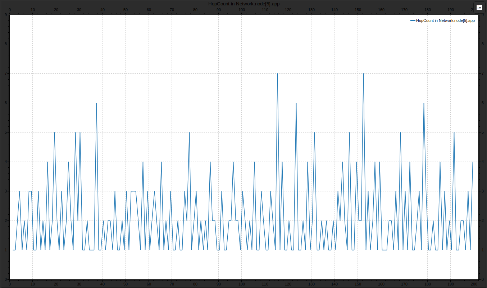

Comparado con el caso anterior, este gráfico varía más ya que hay más nodos transmitiendo. Notar que los paquetes que menos llegan son los que generan los nodos más lejanos, esto debido al tiempo que pasan encolados en cada nodo.

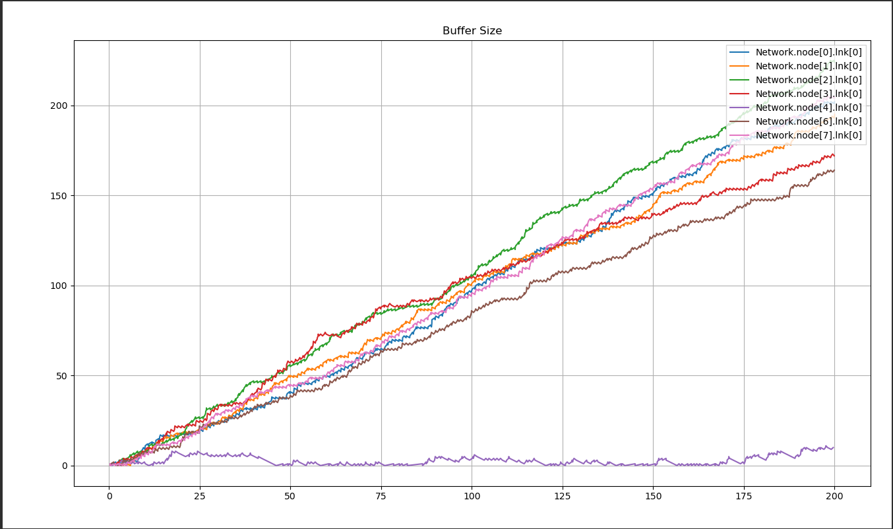

En cuanto a los buffers, se puede ver que se generaliza el problema del buffer del nodo 0 del caso anterior a todos los nodos (excepto el 4 y el 5), algúnos se llenan más que otros. Al nodo 4 le sucede lo mismo que al nodo 2 en el caso anterior; como solo genera paquetes, su buffer se mantiene casi constante.

Finalmente, analicemos la demora de un paquete desde que se generó hasta que llegó al nodo receptor.

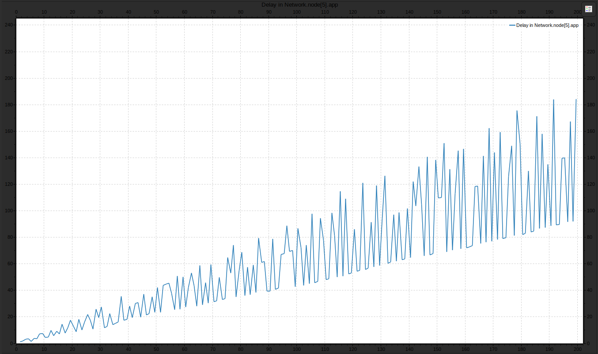

Vemos que se repite lo mismo del caso uno, pero esta vez la demora es y será cada vez mayor. Esto se debe que cada nodo envía paquetes por lo que cada nodo tendrá más congestión, entonces, cada paquete demora más tiempo encolado en cada nodo. Notar que el gráfico tiene una mayor frecuencia debido a que hay más nodos transmisores; los paquetes generados por los nodos más cercanos (en sentido horario) demoran menos mientras que los generados por los más lejanos demoran más. El promedio de demora es de 64.53s. Solo 199 paquetes llegan a destino.

#### Preguntas

**Caso 1**

- **¿Qué métricas se obtienen?** Se obtienen métricas de cantidad de saltos que realizan los paquetes que llegan a destino, demora total de los paquetes que llegan a destino, cantidad de paquetes encolados en los buffers de cada nodo y paquetes recibidos.
- **¿Cómo es el uso de los recursos de la red?** La red se sobrecarga en el nodo 0. Podría mejorarse si los paquetes del nodo 2 enviaran paquetes al nodo 5 en sentido antihorario.

**Caso 2**

- **Determine a partir de qué valor de interArrivalTime se puede garantizar un equilibrio o estabilidad en la red. Justifique**. A partir de un interArrivalTime de exponential(8) se puede garantizar una estabilidad en la red. Probablemente debido a la cantidad de nodos enla red.

Tarea Diseño
-

Esta tarea se basa en analizar los casos de la tarea anterior pero con un algoritmo de enrutamiento diseñado por nosotros. 

Nuestro algoritmo es un algoritmo de control de flujo alternante. Inicialmente, los nodos "generadores" envían flujo en sentido horario, los nodos de "transporte" chequean el tamaño de las colas de los enlaces. Si el tamaño sobrepasa un umbral definido por el parámetro "queueThreshold", se envía un paquete "feedback" hacia el nodo generador de ese paquete. Cuando el nodo recibe este paquete, cambia el sentido de su flujo dado por "currentDirection" para evitar la congestión en esa dirección. Para ello, creamos un nuevo tipo de paquete llamado "feedbackPacket" y modificamos el tipo "Packet" dado porla catedra para que registre el tamaño de los buffers por los que pasa, también añadimos un campo "direction" el cual nos sirve para actualizar la dirección de cada nodo por el cual cada paquete de datos pas, obteniendo así un flujo continuo.

**Caso 1**

Tiene la misma configuración que en la tarea de diseño.

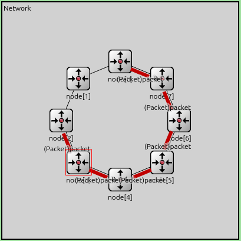

- **Saltos**

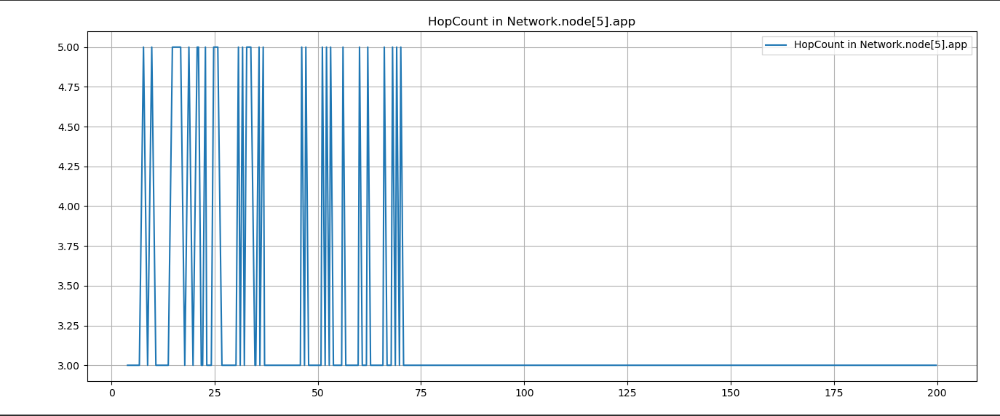

Vemos que en el primer minuto de ejecución aproximadamente los paquetes se enrutan igual que con el otro algoritmo, luego, el algoritmo hace que los paquetes que se generan desde el nodo 2 se manden en sentido antihorario, de modo que los paquetes que salen tanto del nodo 0 como el nodo 2 toman el camino más corto.

- **Buffers**

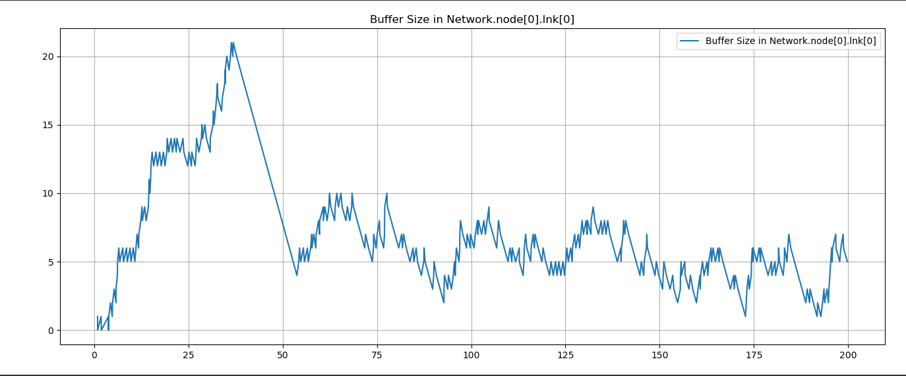

Los paquetes que salen del nodo 0 siempresiguen la misma ruta. Vemos que a partir del minuto aproximadamente (Cuando el nodo 2 cambia la dirección) la cantidad de paquetes almacenados en la cola del nodo 0 disminuye y se estabiliza entre 0 y 10 paquetes.

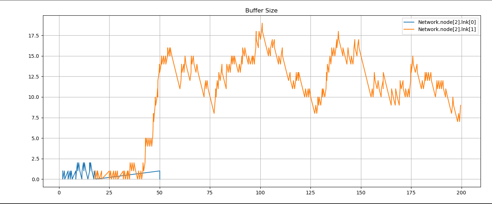

En este gráfico vemos como al principio el nodo 2 comienza mandando paquetes por lnk 0 haciendo que su cola se empieze a llenar, pero después de un momento cambia la dirección y comienza a mandar por lnk 1. Lo que no pudimos entender bien es por qué se estabiliza en una cantidad de paquetes mayor al nodo 0.

- **Delay**

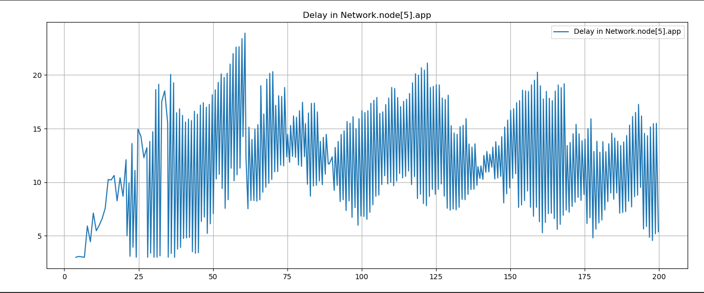

Vemos que se redujo casi un 80% la demora respecto al mismo caso con el otro algoritmo. Este gráfico nos dice que hubo una mejora significativa en el uso de la red ya que los nodos 0 y 2 mandan sus paquetes por rutas diferentes, lo que hace que no se encolen paquetes en gran medida.

La demora promedio es de 12.09s, esto quiere decir que el tiempo medio de demora también se redujo un 80% aprox. comparado con el otro algoritmo.

Tambien casi que se duplicó la cantidad de paquetes recibidos (370) respecto al algoritmo anterior (196).

**Caso 2**

Tiene la misma configuración que la tarea de diseño.

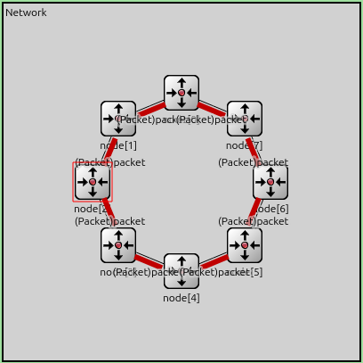

- **Saltos**

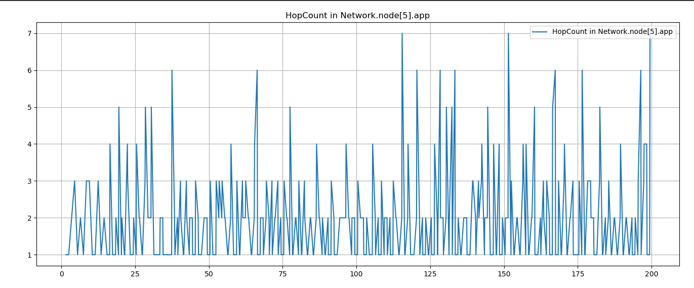

Como se ve en este gráfico, el algoritmo no siempre toma el camino más corto. Puede suceder que un paquete llegue a un nodo y justo sobrepase el umbral, lo que hace que cambie el sentido y tenga que recorrer nodos que ya recorrió. En cuanto a cantidad de saltos, es parecido al mismo caso con el otro algoritmo.

- **Buffers**

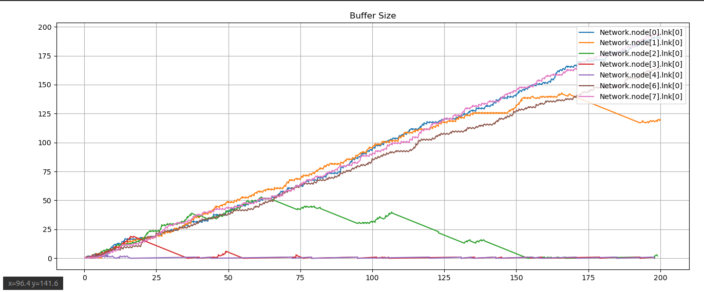
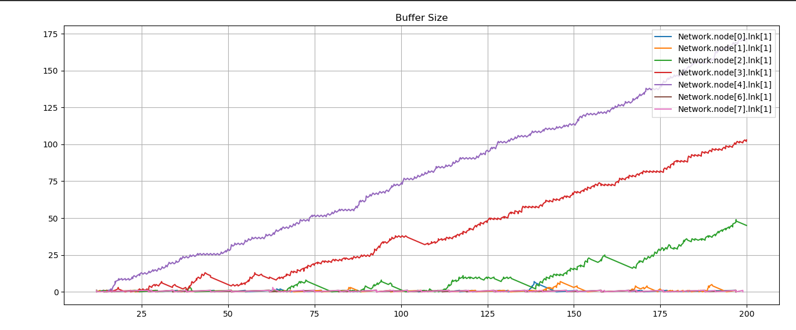

Agregamos el gráfico del buffer de lnk 1 ya que ahora si se pueden enviar paquetes en sentido antihorario. 

Vemos que los paquetes que más mandan por lnk 0 son los nodos 0 7 1 6, que son los que tienen un camino más corto yendo en sentido horario, mientras que los nodos 2 3 4 mandan más por lnk 1, que son los que tienen un camino más corto yendo en sentido antihorario.

También vemos que los que mandan por lnk 1 generalmente comienzan mandando por lnk 0, pero luego cuando se comienzan a congestionar los nodos cambian el sentido.

- **Delay**

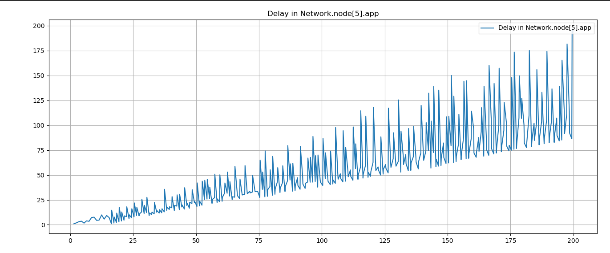

Vemos que a comparación del otro algoritmo el delay de algunos paquetes es mayor puesto que no necesariamente toma el camino más corto.

El delay total promedio es de 57.66s, que es un poco menor al delay del otro algoritmo. Finalmente, se reciben 383 paquetes frente a los 199 que recibe elotro algoritmo (casi el doble).

#### Preguntas

- **¿Cuánto mejoran las métricas? ¿Por qué?** En el caso del delay y de la cantidad de paquetes en los buffer, vimos que hubo un aumento de casi el doble de paquetes que llegaron a destino, esto es porque se aprovechó más la distribución de la red, evitando que los paquetes se intentaran enviar por una ruta muy congestionada. Respecto a la cantidad de saltos, en principio con el umbral propuesto la cantidad de saltos de algunos paquetes no mejoró.
- **¿Hay loops de enrutamiento?** Depende, puede haber o no. Nuestra implementación trata de evitar esto aumentando el umbral de cada nodo cada vez que se lo tiene en cuenta para enviar un Feedback, evitando así Feedbacks dobles, flujos que cambien a otras direcciones también congestionadas, etc. Además, especificando la dirección de cada paquete en cada uno de ellos, hacemos que estos respeten el flujo, actualizando la dirección de los propios nodos (esto se puede ver en net.cc, cuando un paquete de datos llega, este actualiza la dirección del módulo net haciendo currentDirection = pkt->getDirection())
- **¿Ve alguna manera de mejorar aún más su diseño?** Si. Los paquetes podrían tomar como dirección inicial el camino más corto hacia el nodo destino. Nuestro código inicializa la dirección de estos en sentido horario. Además, se podrían tomar otros valores de los parámetros queueThersold y thersoldIncrease en el móduo net.cc, nuestra implementación tiene valores predeterminados (9 y 10 respectivamente) porque nos pareció razonable. Estos valores también podrían parametrizarse para hacer distintas simulaciones, indicando su valor en omnet.ini

Conclusión
-
En la primera parte de este experimento pudimos comprender por qué el algoritmo de enrutamiento propuesto no es óptimo; tiene un alto delay causado por la congestión de los buffers intermedios, lo que provoca que lleguen menos paquetes a su destino.

En la segunda parte pudimos mejorar las métricas, unas significativamenta más que otras, ya que se distribuyó mejor el uso de la red.

Finalmente, pudimos comprender más a fondo el funcionamiento de una y como tratar algunos de sus problemas aplicando soluciones prácticas vistas en el teórico.

Anéxo
-
La única herramienta de inteligencia artificial que se usó fue chatGPT para cuestiones del informe.